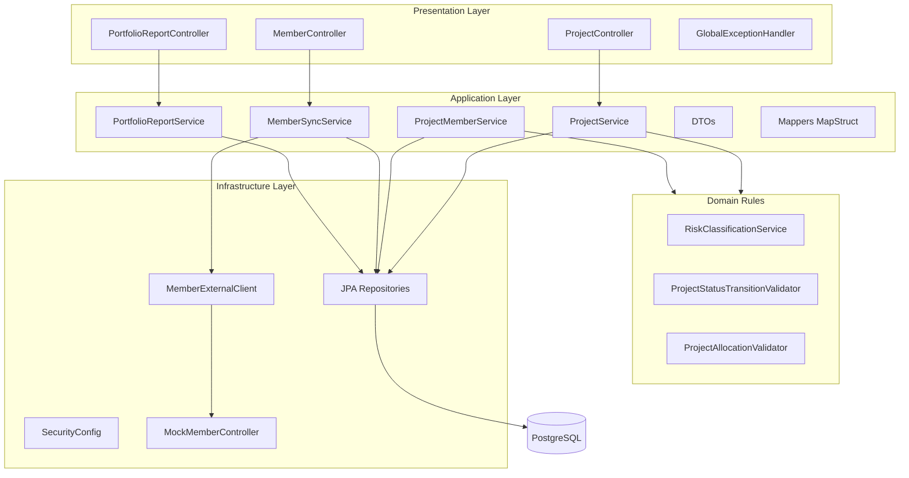
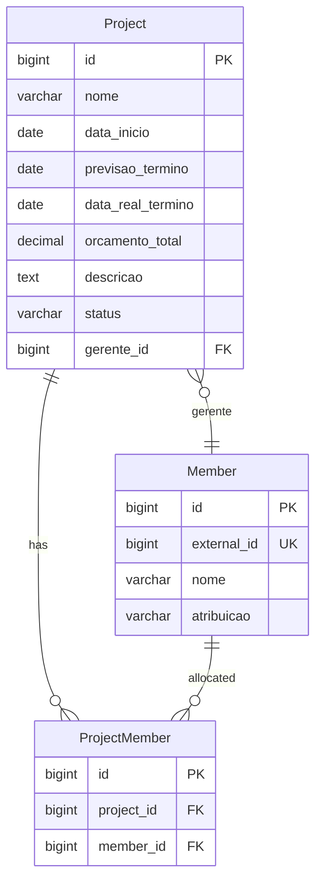
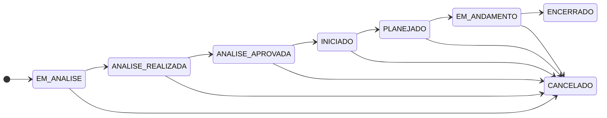
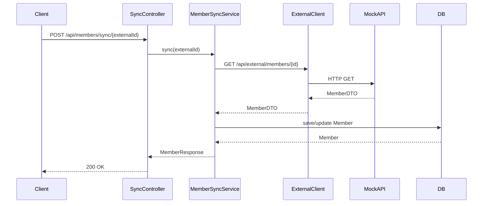

# Arquitetura — Sistema de Portfólio de Projetos

## Visão Geral

Aplicação monolítica Spring Boot com arquitetura em camadas (MVC), separação de responsabilidades conforme SOLID e integração com API externa mockada para gestão de membros.

---

## Diagrama de Camadas



---

## Modelo de Dados



---

## Estrutura de Pacotes

```
br.com.portifolio/
├── PortifolioApplication.java
├── config/
│   ├── SecurityConfig.java
│   ├── OpenApiConfig.java
│   └── WebClientConfig.java
├── controller/
│   ├── ProjectController.java
│   ├── ProjectMemberController.java
│   ├── MemberSyncController.java
│   ├── PortfolioReportController.java
│   └── ExternalMemberController.java   # simula API externa de membros
├── dto/
│   ├── request/
│   └── response/
├── entity/
│   ├── Project.java
│   ├── Member.java
│   └── ProjectMember.java
├── enums/
│   ├── ProjectStatus.java
│   ├── MemberRole.java
│   └── RiskLevel.java
├── exception/
│   ├── ResourceNotFoundException.java
│   ├── BusinessRuleException.java
│   ├── InvalidStatusTransitionException.java
│   └── GlobalExceptionHandler.java
├── mapper/
│   ├── ProjectMapper.java
│   └── MemberMapper.java
├── repository/
│   ├── ProjectRepository.java
│   ├── MemberRepository.java
│   ├── ProjectMemberRepository.java
│   └── spec/
│       └── ProjectSpecification.java   # critérios JPA para filtros
├── service/
│   ├── ProjectService.java
│   ├── ProjectMemberService.java
│   ├── MemberSyncService.java
│   ├── PortfolioReportService.java
│   └── validator/                      # regras de negócio isoladas (SRP)
│       ├── RiskClassificationService.java
│       ├── ProjectStatusTransitionValidator.java
│       └── ProjectAllocationValidator.java
└── client/
    ├── MemberExternalClient.java
    └── MemberExternalClientImpl.java
```

---

## Fluxo de Status



---

## Endpoints da API

### Projetos

| Método | Path | Descrição |
|--------|------|-----------|
| GET | `/api/projects` | Listagem paginada com filtros |
| GET | `/api/projects/{id}` | Detalhe com risco calculado |
| POST | `/api/projects` | Criar projeto |
| PUT | `/api/projects/{id}` | Atualizar projeto |
| PATCH | `/api/projects/{id}/status` | Transição de status |
| DELETE | `/api/projects/{id}` | Excluir projeto |

**Filtros:** `status`, `nome`, `gerenteId`, `dataInicioDe`, `dataInicioAte`, `nivelRisco`

### Membros e Alocação

| Método | Path | Descrição |
|--------|------|-----------|
| POST | `/api/members/sync/{externalId}` | Sincronizar membro da API externa |
| POST | `/api/projects/{id}/members` | Alocar membro ao projeto |
| DELETE | `/api/projects/{id}/members/{memberId}` | Remover alocação |
| GET | `/api/projects/{id}/members` | Listar membros alocados |

### Relatório

| Método | Path | Descrição |
|--------|------|-----------|
| GET | `/api/reports/portfolio` | Relatório resumido do portfólio |

### API Externa Mockada

| Método | Path | Descrição |
|--------|------|-----------|
| POST | `/api/external/members` | Criar membro externo |
| GET | `/api/external/members` | Listar membros externos |
| GET | `/api/external/members/{id}` | Consultar membro externo |

---

## Fluxo de Sincronização de Membros



---

## Tratamento de Exceções

| Exceção | HTTP | Descrição |
|---------|------|-----------|
| `ResourceNotFoundException` | 404 | Recurso não encontrado |
| `BusinessRuleException` | 422 | Violação de regra de negócio |
| `InvalidStatusTransitionException` | 422 | Transição de status inválida |
| `MethodArgumentNotValidException` | 400 | Validação de request |
| Demais | 500 | Erro interno |

Formato de resposta:

```json
{
  "timestamp": "2026-06-22T10:00:00",
  "status": 422,
  "error": "Unprocessable Entity",
  "message": "Descrição do erro",
  "path": "/api/projects/1/status"
}
```

---

## Segurança

- Spring Security com autenticação HTTP Basic
- Usuário in-memory configurado em `application.yml`
- Endpoints `/api/external/**` e `/swagger-ui/**` liberados (mock externo e docs)
- Demais endpoints exigem autenticação

---

## Princípios SOLID Aplicados

| Princípio | Aplicação |
|-----------|-----------|
| **S** — Single Responsibility | Controllers só roteiam; regras em `service/rule/`; mappers só convertem |
| **O** — Open/Closed | Validators extensíveis sem alterar services existentes |
| **L** — Liskov Substitution | `MemberExternalClient` interface com implementação substituível |
| **I** — Interface Segregation | DTOs de request/response separados por operação |
| **D** — Dependency Inversion | Services dependem de abstrações (interfaces de client e repository) |
